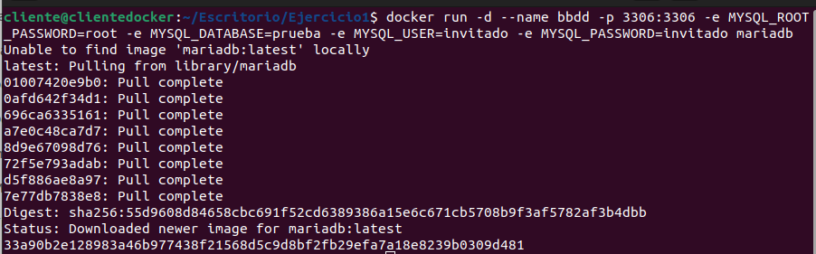
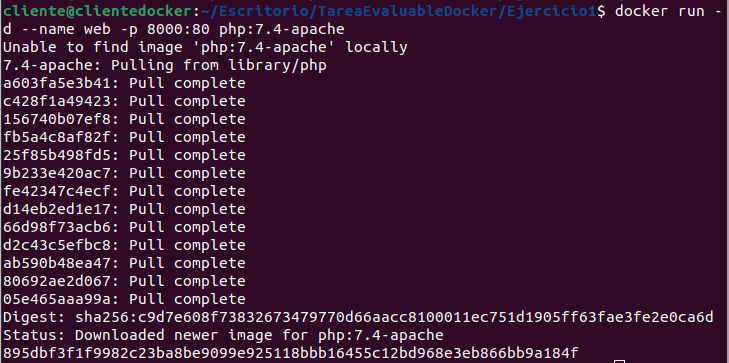
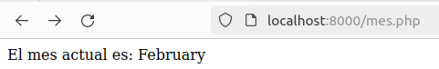
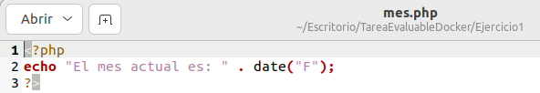
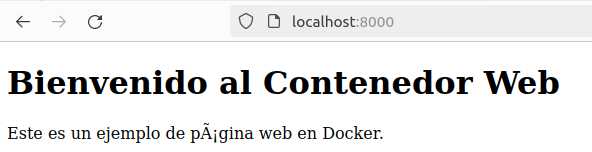
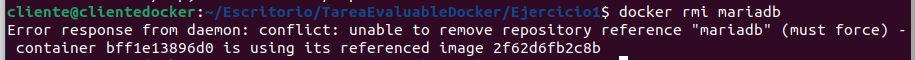
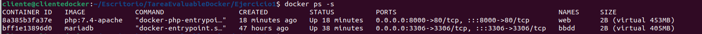

# Ejercicio 1 - Servidor de base de datos

> Javier González Díaz

1.- Arrancar un contenedor que se llame bbdd y que ejecute una instancia de la imagen mariadb para que sea accesible desde el puerto 3306.
Antes de arrancarlo visitar la página del contenedor en Docker Hub y establecer las variables de entorno necesarias para que:

- La contraseña de root sea root .
-  Crear una base de datos automáticamente al arrancar que se llame prueba .
- Crear el usuario invitado con la contraseña invitado .

```bash
$ docker run -d --name bbdd -p 3306:3306 -e MYSQL_ROOT_PASSWORD=root -e MYSQL_DATABASE=prueba -e MYSQL_USER=invitado -e MYSQL_PASSWORD=invitado mariadb
```



<<<<<<< HEAD
2.- Arrancar un contenedor que se llame web y que ejecute una instancia de la imagen php:7.4-apache para que sea accesible desde el puerto 8000.

```bash
$docker run -d --name web -p 8000:80 php:7.4-apache
=======
2.- Arranca un contenedor que se llame web y que ejecute apacghe y php en ese contenedor debe havber un fichero index.html y otro mes.php que muestra el mes actual

```bash
$ docker run -d --name web -p 8000:80 -v "SPWD":/var/www/html php:7.4-apache
>>>>>>> ejercicio1
```



<<<<<<< HEAD
- Crea un fichero mes.php





- Crea un fichero index.html

  

- Comprueba que no se puede borrar la imagen mariadb mientras el contenedor bbdd está creado



- Tamaño del contenedor



=======


- Captura de pantalla y documento que desde el navegador muestre el fichero index.html .

  

- Captura de pantalla y documento que desde un navegador muestre la salida del script mes.php .


- Captura de pantalla y documento donde se vea el tamaño del contenedor web después de crear los
  dos ficheros.

  
  
- Captura de pantalla y documento donde desde un cliente de base de datos (instalado en tu ordenador)
  se pueda observar que hemos podido conectarnos al servidor de base de datos con el usuario creado y
  que se ha creado la base de datos prueba ( show databases ). El acceso se debe realizar desde el
  ordenador que tenéis instalado docker, no hay que acceder desde dentro del contenedor, es decir, no
  usar docker exec .


- Captura de pantalla y documento donde se comprueba que no se puede borrar la imagen mariadb
  mientras el contenedor bbdd está creado.


>>>>>>> ejercicio1
