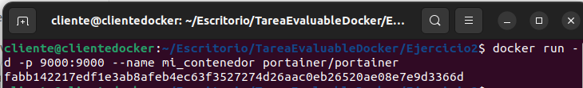
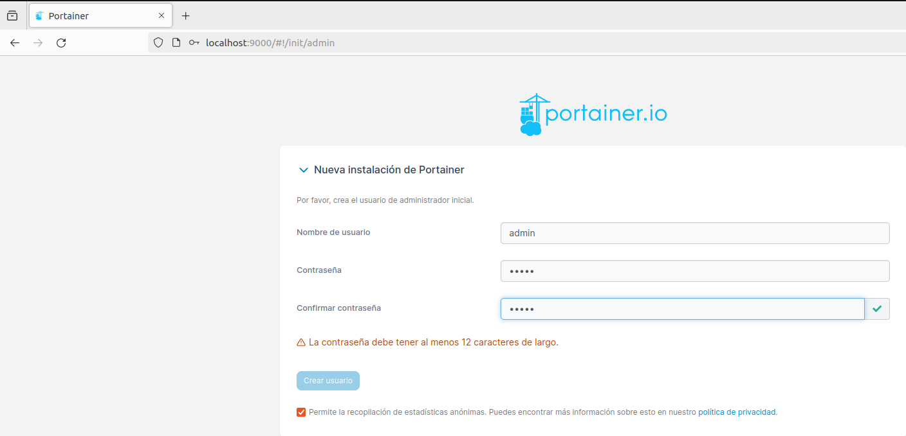
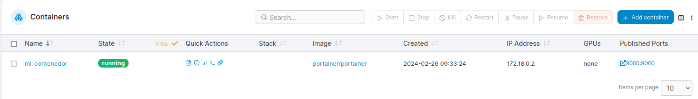
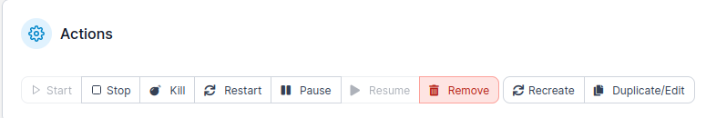
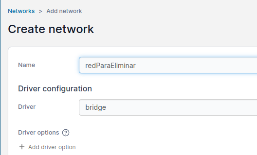
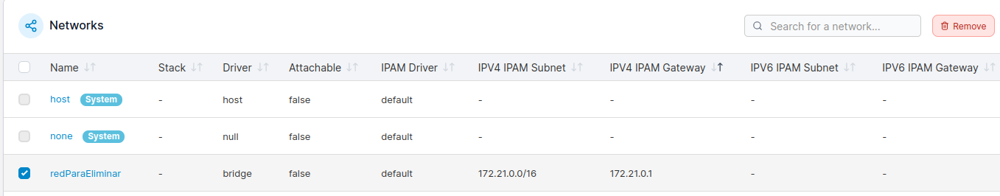
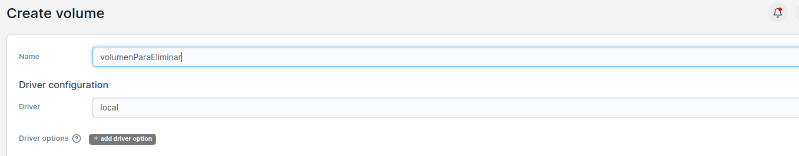
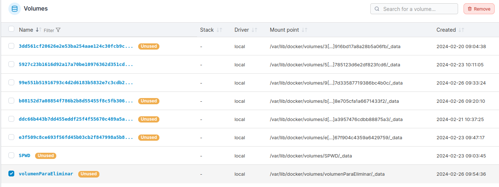

# Ejercicio 2 - Portainer

Utiliza una imagen de 'Portainer' para gestionar Docker.
Documenta la aplicación, su puesta en funcionamiento y realiza capturas de varias operaciones, por ejemplo:

```bash
$ docker run -d -p 9000:9000 --name mi_contenedor portainer/portainer
```





Muestra contenedores activos:



Para un contenedor y borra un contenedor:



Muestra alguna operación con redes Docker

- Crear una red:



- Borrar una red



Muestra alguna operación con volúmenes Docker:

- Crear un volumen:

  

- Borrar un volumen:

